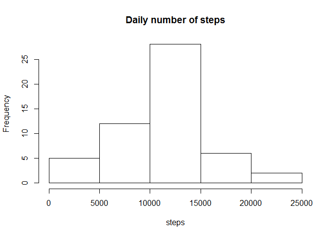
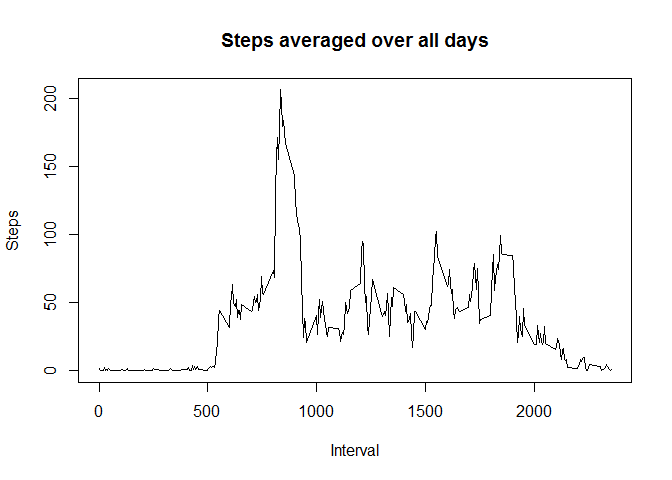
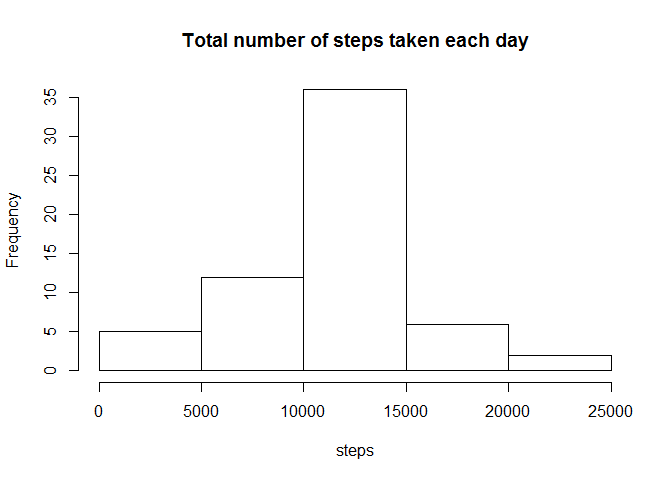
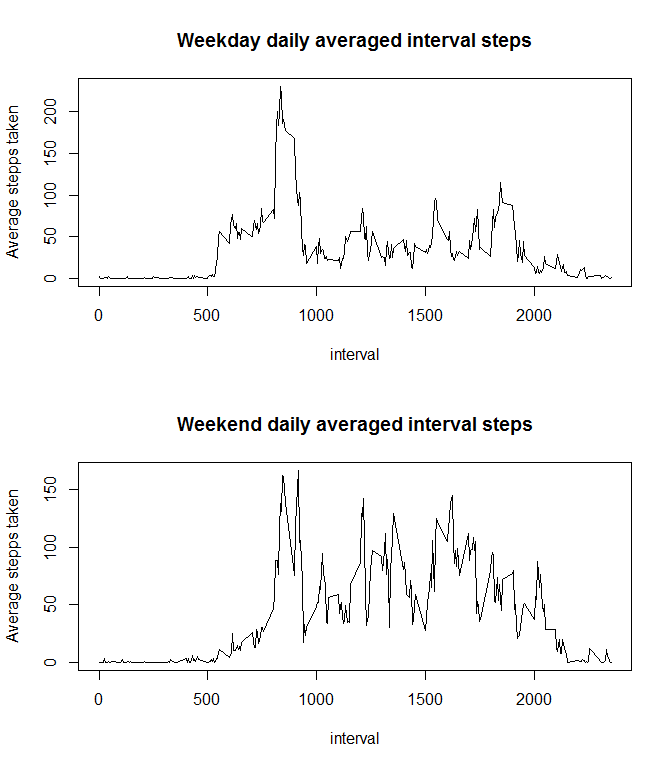

# Reproducible Research: Peer Assessment 1


## Loading and preprocessing the data
1. Load the data

```r
# Load the data
data <- read.csv(
    unz("activity.zip", "activity.csv"),
    colClasses = c('integer', 'POSIXct', 'integer'),
    na.strings = 'NA'
)
```


2. Transformation and processing

```r
# Drop NA values using complete.cases
complete <- data[ complete.cases( data ), ]
```

## What is mean total number of steps taken per day?

1. Calculate the total number of steps taken per day

```r
dailySteps <- group_by( complete, date ) %>% summarise( steps = sum( steps ) )
mean(dailySteps$steps)
```

```
## [1] 10766.19
```
The mean total number of steps taken per day is **10766**

2. Make a histogram of the total number of steps taken each day

```r
hist( dailySteps$steps, main = 'Daily number of steps', xlab = 'steps' )
```

 

3. Calculate and report the mean and median of the total number of steps taken per day

```r
dailyStepsMean <- mean( dailySteps$steps )
dailyStepsMean
```

```
## [1] 10766.19
```

```r
dailyStepsMedian <- median( dailySteps$steps )
dailyStepsMedian
```

```
## [1] 10765
```
The mean and median of the number of steps taken per day are **10766** and **10765** respectively.

## What is the average daily activity pattern?

1. Make a time series plot of the 5-minute interval (x-axis) and the average number of steps taken, averaged across all days (y-axis)


```r
groupedByInterval <- group_by(complete, interval) %>% summarise( avgSteps = mean(steps))
plot(
    groupedByInterval,
    type = 'l',
    main = 'Steps averaged over all days',
    xlab = 'Interval',
    ylab = 'Steps'
)
```

 

2. Which 5-minute interval, on average across all the days in the dataset, contains the maximum number of steps?


```r
maxSteps <- (groupedByInterval %>% summarise( maxSteps = max(avgSteps)))$maxSteps
as.integer(maxSteps)
```

```
## [1] 206
```

```r
maxInterval <- groupedByInterval[groupedByInterval$avgSteps == maxSteps, ][['interval']]
as.integer(maxInterval)
```

```
## [1] 835
```
The interval which on average contains the maximum number of steps(**206**) is **835**

## Imputing missing values

1. Calculate and report the total number of missing values in the dataset

```r
missingValueRows <- nrow( data[ is.na( data$steps ), ] )
missingValueRows
```

```
## [1] 2304
```
The original data-set contains **2304** rows with missing (NA)) values.

2. Devise a strategy for filling in all of the missing values in the dataset.  
Filling of missing values shall be done using the existing mean (averaged ofer all days) for that 5-minute interval.

3. Create a new dataset that is equal to the original dataset but with the missing data filled in.  

```r
# create a new dataset
filled <- data

# fill missing values
for(i in 1 : nrow(filled)){
    if(is.na(filled[i, "steps"])){
        filled[i, "steps" ] <- 
            groupedByInterval[groupedByInterval$interval == filled[i, 'interval'], 'avgSteps']
    }
}
```

4. Make a histogram of the total number of steps taken each day

```r
dailyStepsFilled <- group_by( filled, date ) %>% summarise( steps = sum( steps ) )
hist( dailyStepsFilled$steps, main = 'Total number of steps taken each day', xlab = 'steps' )
```

 

* Calculate and report the mean and median total number of steps taken per day

```r
dailyStepsMeanFilled <- mean( dailyStepsFilled$steps )
dailyStepsMeanFilled 
```

```
## [1] 10766.19
```

```r
dailyStepsMedianFilled <- median( dailyStepsFilled$steps )
dailyStepsMedianFilled
```

```
## [1] 10766.19
```
The mean and median of the number of steps taken per day after imputation are **10766** and **10766** respectively.

* Do these values differ from the estimates from the first part of the assignment? What is the impact of imputing missing data on the estimates of the total daily number of steps?


```r
meanRelativeChange <- 100 * (dailyStepsMeanFilled - dailyStepsMean) / dailyStepsMean
meanRelativeChange
```

```
## [1] 0
```

```r
medianRelativeChange <- 100 * (dailyStepsMedianFilled - dailyStepsMedian) / dailyStepsMedian 
medianRelativeChange
```

```
## [1] 0.01104207
```

Because of the imputing strategy employed the relative mean and median changes are 0 and/or neglegable.
Overall total daily number of steps increases by the number of total steps imputed by the process.


## Differences in activity patterns between weekdays and weekends?

1. Create a new factor variable in the dataset with two levels - "weekday" and "weekend" indicating whether a given date is a weekday or weekend day.


```r
filled$day <- as.factor( ifelse(as.POSIXlt(data$date)$wday %in% c( 0, 6 ), 'weekend', 'weekday' ) )
groupedByIntervalAndDay <- group_by( filled, interval, day ) %>% summarise( avgSteps = mean(steps) )
```

2. Make a panel plot containing a time series plot (i.e. type = "l") of the 5-minute interval (x-axis) and the average number of steps taken, averaged across all weekday days or weekend days (y-axis).


```r
par( mfrow = c( 2, 1 ) )

# Weekday plot
plot(
    groupedByIntervalAndDay[groupedByIntervalAndDay$day == 'weekday', c( 'interval', 'avgSteps') ],
    type = 'l',
    main = 'Weekday daily averaged interval steps',
    ylab = 'Average stepps taken'
)

# Weekend plot
plot(
    groupedByIntervalAndDay[groupedByIntervalAndDay$day == 'weekend', c( 'interval', 'avgSteps') ],
    type = 'l',
    main = 'Weekend daily averaged interval steps',
    ylab = 'Average stepps taken'
)
```

 


